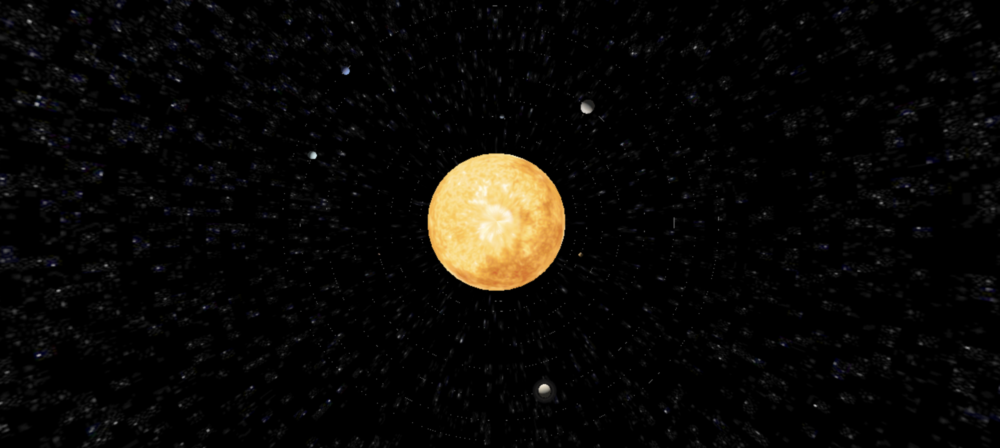
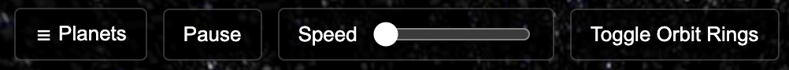
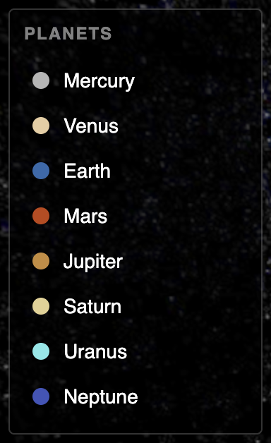

<h1 align = "center"><b>Zak's Solar System</b></h1>

  

<h2>INSTALLATION AND RUNNING</h2>

In order to run, you must have node.js installed, which can be found here: https://nodejs.org/en/download.

Make sure node is in your system path

Once installed, navigate to the project directory in your terminal and run these commands in the order shown:

npm install --save three

npm install --save-dev vite

npx vite

After running 'npx vite,' the terminal will produce a localhost. Paste it into your browser to see the scene.

<h2>SOLAR SYSTEM CONTROLS</h2>

The program uses general **WASD** controls for horizontal movement, **Q** to move upwards, and **E** to move downwards.

The user can also press the **H** key to hide all UI elements

To rotate around the scene, **CLICK AND DRAG** the mouse along the screen.

**CLICK** a planet to lock onto it.

<h2>UI Controls</h2>

<h3>Top Menu Bar:</h3>

  

The **PLANETS** button will bring up a menu of clickable planets. Click it again to close the menu.

The **PAUSE** button stops all planet and moon movement. The camera can still move while paused and the user can still lock onto planets.

The **SPEED** slider adjusts the speed at which planets and moons orbit and rotate. The initial speed value is 10, but the range goes from 1-100.

The **TOGGLE ORBIT RINGS** button toggles the visibility of the rings that trace the planets' orbits

<h3>Planets Menu: </h3>

  

Clicking on any one of the planet names will lock the camera on to that planet. 

<h2>Note from the creator:</h2>

I had a lot of fun creating this project and getting to learn THREE.JS. This is probably my biggest project I've made since starting my computer science major, and I think it went pretty well. If you have any recommendations on ways I could improve the project or just ideas, be sure to reach out to me using the link to my LinkedIn on my GitHub homepage. I hope you enjoy this project as much as I enjoyed making it!

